# Day 1 & 2: Defining system & idea search & inspi
My initial plan was to build something resembling a lighting control unit like the grandMA3.
I need it to manage show lighting synchronized with audio (via LTC timecode) and capable of outputting up to 13 DMX universes.
For this project I need this:
- Calcul hearth & memory
  - SDRAM
  - Flash QSPI
  - STM32
  - RTC
- Alim & safety
  - 24V IN
  - Protection (fuse)
  - Régulation
  - Thermal management
- DMX Network
  - Ethernet (for ArtNet)
  - 13 DMX Output
  - LTC Timecode
- Storage
  - MicroSD (for soft and show lighting)
  - EC11 for navigate menues
  - Buzzer for heat alert
  - Status led
  - Heat capter
  - USB-C & JST for debug, prog / MAJ

For software Part:
- Artnet / sACN management
- RDM
- OSC
- Standalone mode
- Multiple sourced MTC / LTC
- EVENT management (with internal sensor)
- Failover
- DMX Fusion
- Monitoring DMX Cable
- Internal Web server
- Ventilation management
- Logs
- DMX Repeater & stock show

My inspiration & search:
https://www.malighting.com/product/grandma3-processing-unit-m-4010510/
https://www.malighting.com/product/grandma3-replay-unit-4010507/
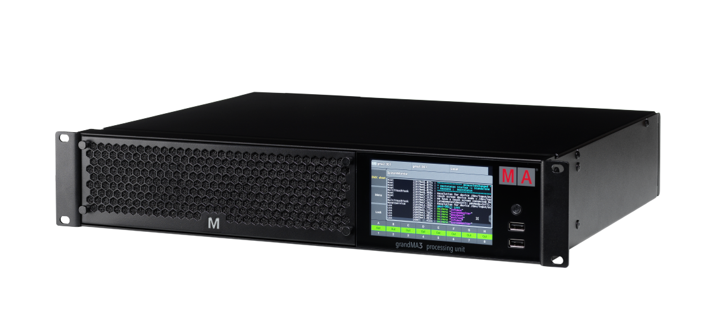

https://youtu.be/EvGTUB3FaL8?si=SulDiDoXiLldTTPZ
https://youtu.be/4lftq21JBpA?si=IHUjlWr8QZtvwl7I

And more other...

**Total time spent: 3 hours**

# Day 3: Find components for each functionnality

| **Component**               | **Usage / Purpose**                                             |
| --------------------------- | --------------------------------------------------------------- |
| **STM32H743ZIT6**           | Main high-performance microcontroller (the "brain").            |
| **SDRAM**                   | External RAM for heavy real-time data buffering.                |
| **QSPI Flash**              | Non-volatile storage for firmware execution and code.           |
| **W5500**                   | Ethernet interface for network lighting control (Art-Net/sACN). |
| **MAX3485**                 | RS-485 transceivers for DMX serial communication ports.         |
| **CD74HC4067**              | Multiplexer to expand and route multiple DMX channels.          |
| **SM712 / TVS Diodes**      | Surge and ESD protection for data lines.                        |
| **24V In & Fuse**           | Main power input and overcurrent protection.                    |
| **MOSFET (Power / 2N7002)** | Switching control for the cooling fan and loads.                |
| **MicroSD Card**            | Storage for show files, logs, and configurations.               |
| **EC11 Rotary Encoder**     | User interface wheel for menu navigation.                       |
| **Buzzer & LEDs**           | Audio alerts and status indicators.                             |
| **RTC & CR2032 Battery**    | Real-time clock backup for precise event timestamps.            |
| **I2C Temp Sensors**        | Thermal monitoring of the board.                                |
| **Crystal 25MHz**           | External clock source for high-speed MCU timing.                |
| **USB-C Receptacle**        | Programming, debugging, and power connection.                   |

With all of theses components, I had a good starting point to begin designing in KiCad.
But I had forgotten that finding the perfect part for the project in KiCad is very complicated, so I had to modify certain components and tweak the footprints to get everything working.
I spent a lot of time installing the necessary libraries—such as the JLCPCB one, or even the STM32 library, which wasn't included in my KiCad installation.
I watched this video that explains how to do it: https://youtu.be/DhJCy-LbRto?si=LvXneZgDRm5MqSkQ
I then placed my components and grouped them by function:

**Total time spent: 3 hours**

# Day 4: Discover STM32CubeMX
That’s where I hit a wall: how do you use an STM32 and figure out its pinout? I had no idea, so I asked an AI; it pointed me toward a piece of software called STM32CubeMX. I downloaded it and stepped into a murky world where every setting I tweaked seemed to break everything I was doing.
To arrive at a working version, I had to create about eight alternative versions—breaking things and having to start over each time—because I didn't understand the software at all, even with the AI ​​helping me locate the menus...
I literally spent four hours on this pinout, and I really hope I won't have to do it again—it's a nightmare lol.
      

Above, for example, you can see two versions I took screenshots of (the one I had the most hope for).

**Total time spent: 4.5 hours**

# Day 5: Cabling all on KiCad (Part1)
I calmly started wiring everything up on KiCad, thinking it wouldn't take much time.
Unaware that I was

    

That’s five hours spent on Day One of the wiring—starting the job, only to keep having to redo it.

 

**Total time spent: 5 hours**

# Day 6: Cabling all on KiCad (Part2)
Right, after starting this wiring job, I took a day off, and here I am on day 6.

I decided to finish the schematic today so I can start the fun part—the PCB—tomorrow.
So that's what I did. (Just a reminder that my electronics knowledge is limited to the ESP32 ^^)

Before: 

After: 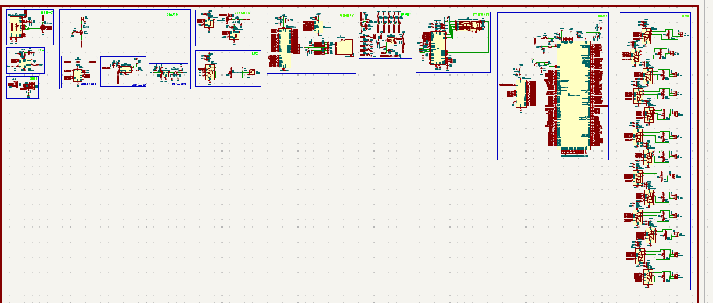
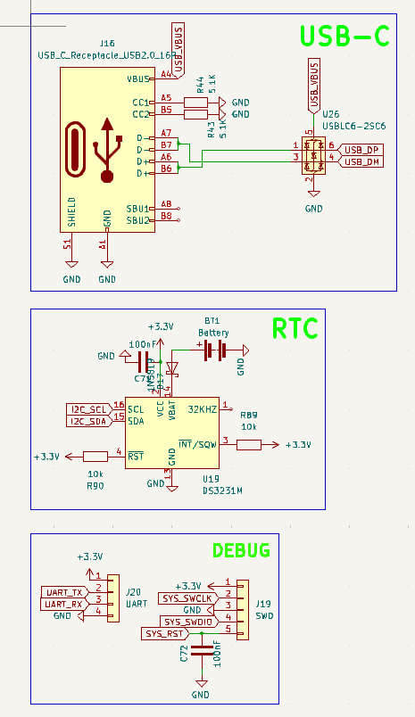
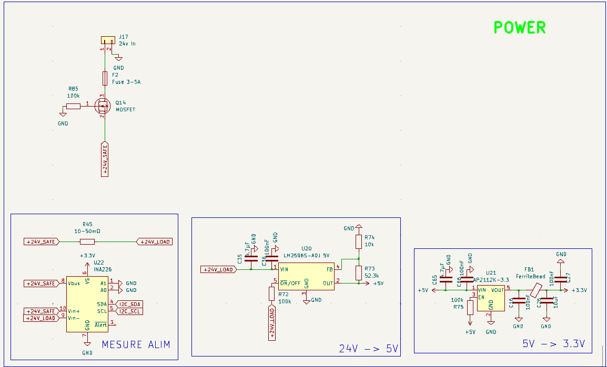
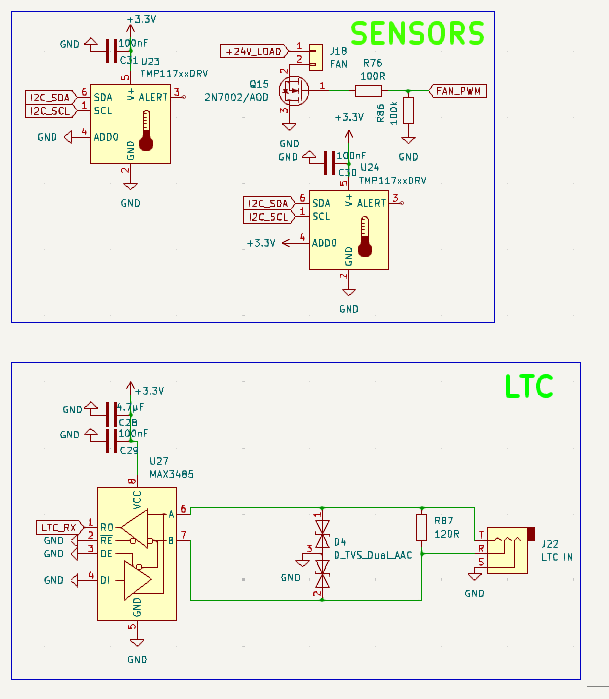
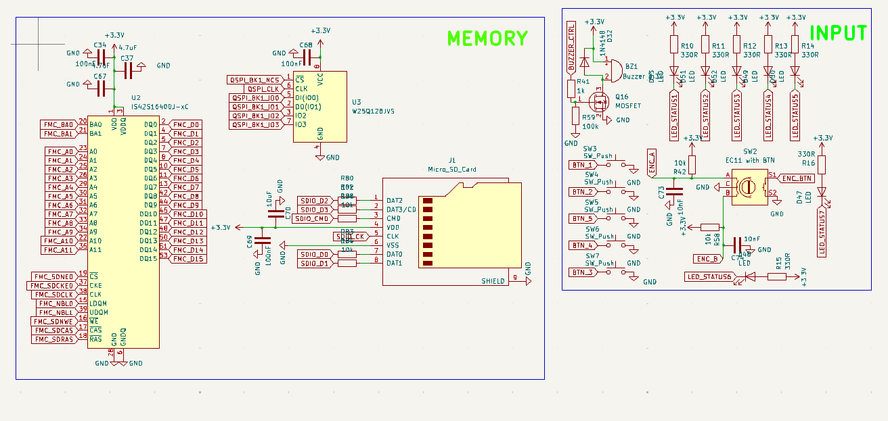
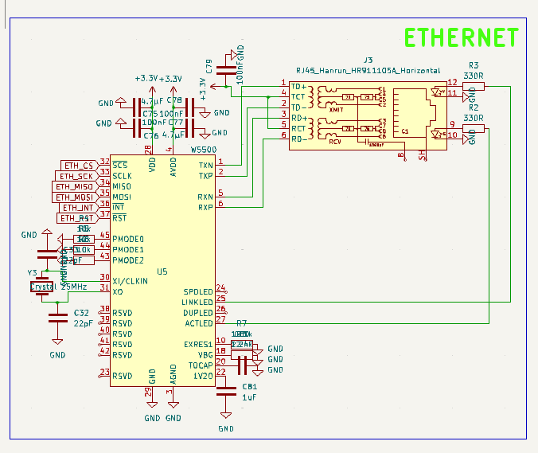
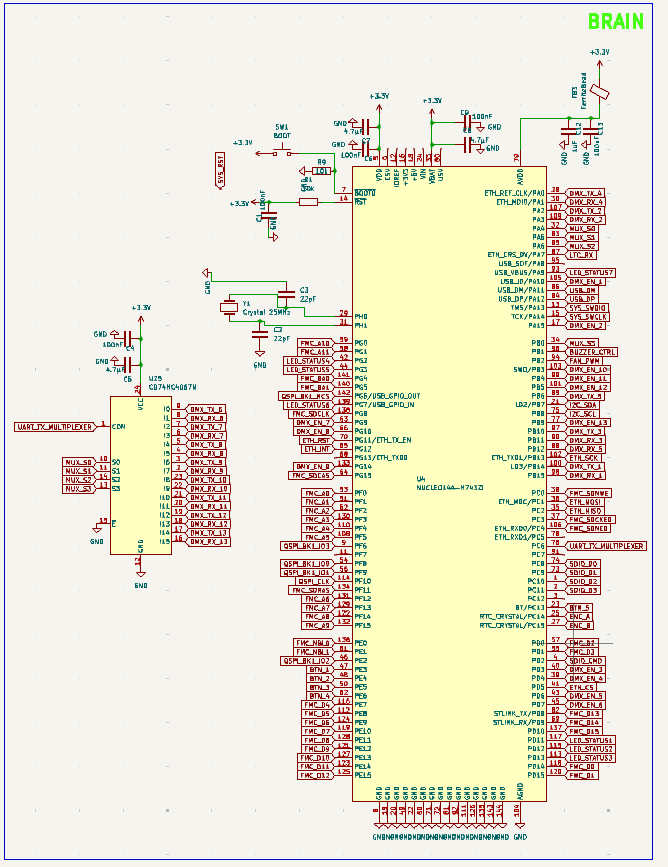
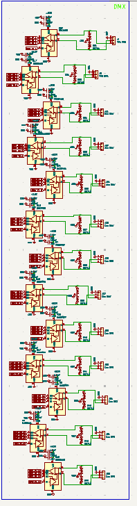

It’s so beautiful and satisfying when it’s finished and passes the ERC.

**Total time spent: 6 hours**

# Day 7: PCB Routing -> Bets Part ...or not
Okay, I woke up excited and eager to do my PCB routing, since I saw it as something quick and simple (bearing in mind that my PCB experience is limited to connecting LEDs to an ESP); so I open my software, but...
I had overlooked a small part of the job—assigning the footprints and schematics—so I spent 45 min properly defining everything (since, as the AI ​​mentioned, this might be the most critical part of the project).
192 fingerprints to assign

Then I started the routing, intending to do everything on two layers.
And then I thought to myself that doing it in two layers might be a bit more complicated than expected.
Anyway, I’ve repositioned all my components—especially the power supply decoupling capacitors—because, for some reason, KiCad wasn't managing to connect them right next to the pins...

Before:
 

After:
 

So, I started wiring up the power supplies and components:

It wasn't as simple as I thought, because I was still working with a 2-layer design, with one layer dedicated to GND.
I've finished almost all the connections, except for the one to the STM32.

**Total time spent: 5 hours**

# Day 8: Routing STM32
The hardest part has begun.
It was a real battlefield, and fortunately, at one point I decided to go with a 4-layer PCB after getting a quote from JLCPCB to check the budget.

Here is state of the PCB before:
  
and after:
    

I love the final 3D result.
Anyway, I exported the PCB... and posted a message on the Forge Help forum to get it reviewed and check for any issues—which honestly wouldn't surprise me at all, given the late hours I was working on it. Lol.
I'll need to remember to add some text to it before having it made !!

**Total time spent: 6 hours**

# Day 9: Estimation
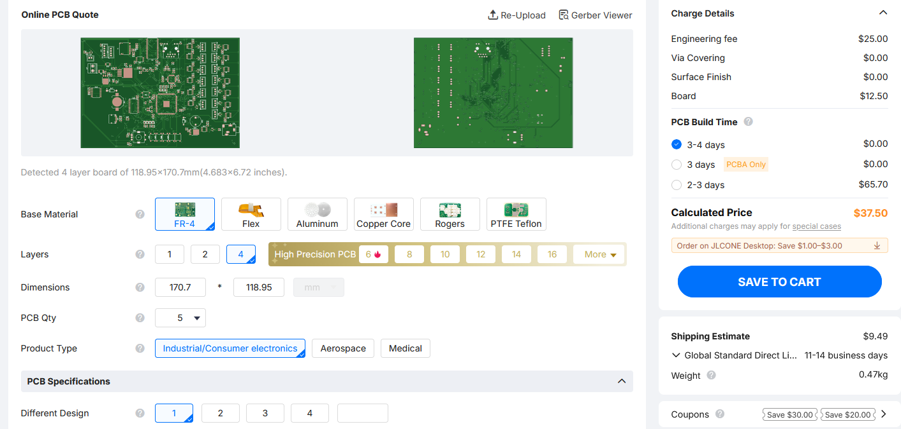
I have made on JLCPCB an estimation
Now I need to think about the software and the 3D printing needed to make it stand (I imagine it a bit like a 3D server rack, so I'm going to try something like that).
Today, I just took a quick look at PCB prices... but I also did a lot of rewording on my JOURNAL.md file using Google Translate to tidy things up.

**Total time spent: 0.5 hours**

# Day 10: Starting KiCad
Import PCB in Kicad
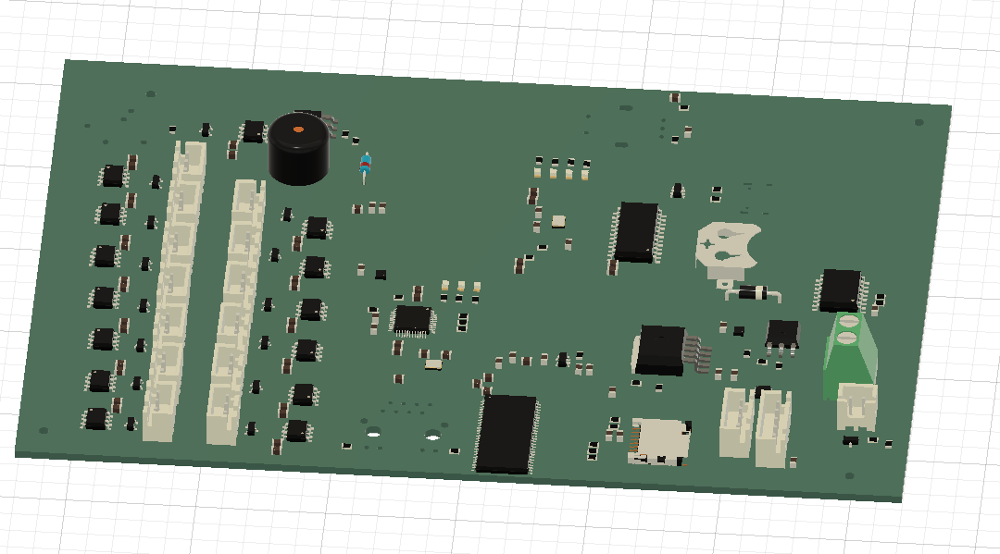

I starting create box:
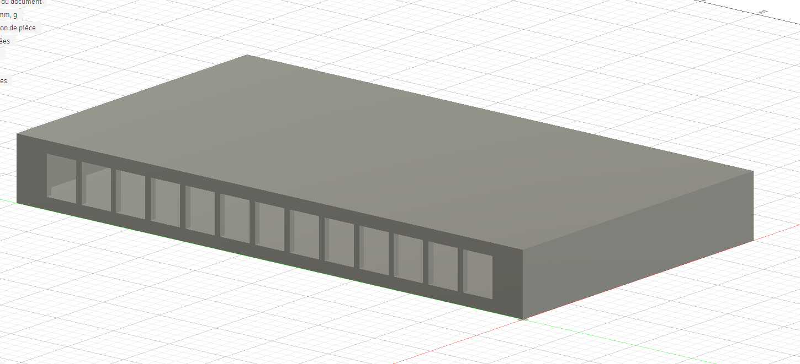

I made box to be rackable if possible

Made hole for USB-C & LTC IN
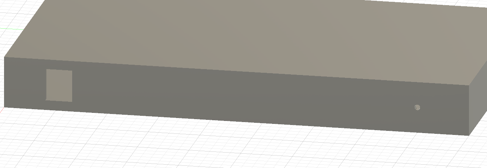

**Total time spent: 0.75 hours**

# Day 11: We continue work
No response on forum to check my card :(
I also re-send another demand ...

So I continue to work on CAD file:

Adding fan hole
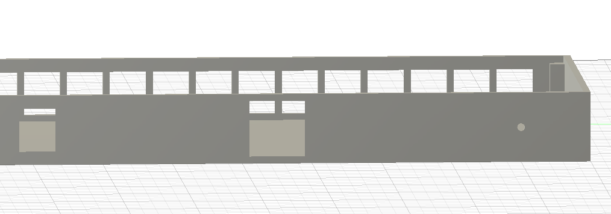

Removing top and add for screw top 
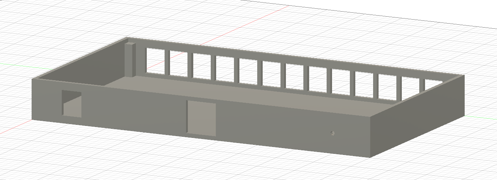

Make top
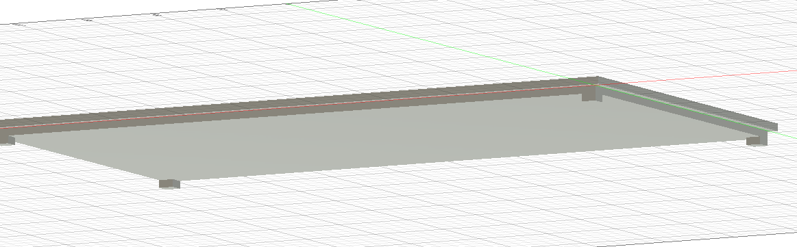

Make assembly
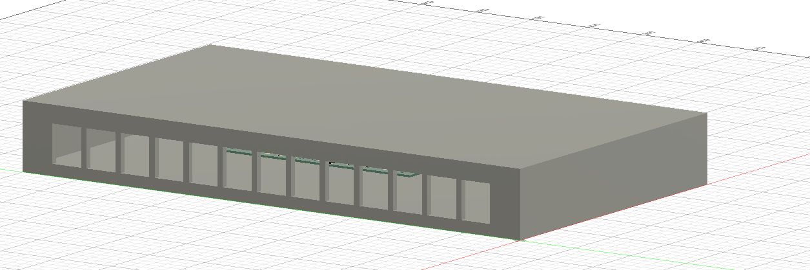

**Total time spent: 1.5 hours**

# Day 12: Make BOM

I start to search each reference on LSCS:

I made it in CSV:
Category / Component,Manufacturer Part / Type,Quantity,Unit Price (USD),Total Price (USD),LCSC Link
Microcontroller,STM32H743ZIT6,1,15.50,15.50,https://www.lcsc.com/category/941.html
Ethernet Controller,W5500,1,2.15,2.15,https://www.lcsc.com/product-detail/C32843.html
DMX Transceiver,MAX3485ESA+,14,0.45,6.30,https://www.lcsc.com/product-detail/C22447116.html
Multiplexer,CD74HC4067M,1,0.32,0.32,https://www.lcsc.com/product-detail/C496123.html
RTC,DS3231M+,1,1.80,1.80,https://www.lcsc.com/product-detail/C1520508.html
SDRAM,IS42S16400J-7TL,1,1.20,1.20,https://www.lcsc.com/product-detail/C94865.html
SPI Flash,W25Q128JVSIQ,1,0.75,0.75,https://www.lcsc.com/product-detail/C113767.html
3.3V Regulator,AP2112K-3.3,1,0.22,0.22,https://www.lcsc.com/product-detail/C23380830.html
5V Regulator,LM2596S-ADJ,1,0.45,0.45,https://www.lcsc.com/product-detail/C194351.html
Power Monitor,INA226AIDGST,1,1.10,1.10,https://www.lcsc.com/product-detail/C2653870.html
Temperature Sensor,TMP117AIDRVR,1,1.40,1.40,https://www.lcsc.com/product-detail/C699536.html
USB ESD Protection,USBLC6-2SC6,1,0.08,0.08,https://www.lcsc.com/product-detail/C5261088.html
DMX TVS Protection,SM712,13,0.15,1.95,https://www.lcsc.com/product-detail/C908219.html
Schottky Diode,1N5819,1,0.03,0.03,https://www.lcsc.com/product-detail/C2474.html
Switching Diode,1N4148,1,0.01,0.01,https://www.lcsc.com/product-detail/C49318123.html
Capacitor 100nF (0805),0805 X7R 50V 100nF,33,0.005,0.17,https://www.lcsc.com/product-detail/C49678.html
Capacitor 4.7µF (0805),0805 X5R 25V 4.7µF,23,0.01,0.23,https://www.lcsc.com/product-detail/C1779.html
Capacitor 22pF (0805),0805 C0G 50V 22pF,4,0.005,0.02,https://www.lcsc.com/product-detail/C1804.html
Resistor 10k (0805),0805 1% 1/8W 10k,15,0.004,0.06,https://www.lcsc.com/product-detail/C2907219.html
Resistor 330R (0805),0805 1% 1/8W 330R,9,0.004,0.04,https://www.lcsc.com/product-detail/C17630.html
Resistor 120R (0805),0805 1% 1/8W 120R,1,0.004,0.004,https://www.lcsc.com/product-detail/C17437.html
RJ45 Connector,HR911105A,1,0.85,0.85,https://www.lcsc.com/product-detail/C12074.html
MicroSD Connector,DM3D-SF,1,0.30,0.30,https://www.lcsc.com/product-detail/C719027.html
USB-C Connector,USB-C 16P (SMD),1,0.18,0.18,https://www.lcsc.com/product-detail/C165948.html
24V Terminal Block,Phoenix 5.08mm 2P,1,0.15,0.15,https://www.lcsc.com/product-detail/C5183929.html
JST XH Connectors,JST-XH 2P/3P/4P/5P,15,0.05,0.75,https://www.lcsc.com/product-detail/C144394.html
3.5mm Audio Jack,Audio Jack 3.5mm (LTC),1,0.12,0.12,https://www.lcsc.com/product-detail/C49284723.html
Rotary Encoder,EC11 with Switch,1,0.25,0.25,https://www.lcsc.com/product-detail/C2991196.html
Push Buttons,Tactile Switch 6x6mm,6,0.03,0.18,https://www.lcsc.com/product-detail/C7528752.html
Buzzer,Buzzer 3.3V,1,0.10,0.10,https://www.lcsc.com/product-detail/C252915.html
Battery Holder,CR2032 Battery Holder,1,0.20,0.20,https://www.lcsc.com/product-detail/C964792.html
Crystal Quartz,Crystal 25MHz (3225),2,0.08,0.16,https://www.lcsc.com/product-detail/C9006.html
Transistor,2N7002,1,0.011,0.011,https://www.lcsc.com/product-detail/C916396.html
Resettable Fuse,2920L500/30GR,1,0.15,0.15,https://www.lcsc.com/product-detail/C19078763.html

in markdown:
| Category / Component | Manufacturer Part / Type | Quantity | Unit Price (USD) | Total Price (USD) | LCSC Link |
| :--- | :--- | :--- | :--- | :--- | :--- |
| **Microcontroller** | STM32H743ZIT6 | 1 | $15.50 | $15.50 | [Link](https://www.lcsc.com/category/941.html) |
| **Ethernet Controller** | W5500 | 1 | $2.15 | $2.15 | [Link](https://www.lcsc.com/product-detail/C32843.html) |
| **DMX Transceiver** | MAX3485ESA+ | 14 | $0.45 | $6.30 | [Link](https://www.lcsc.com/product-detail/C22447116.html) |
| **Multiplexer** | CD74HC4067M | 1 | $0.32 | $0.32 | [Link](https://www.lcsc.com/product-detail/C496123.html) |
| **RTC** | DS3231M+ | 1 | $1.80 | $1.80 | [Link](https://www.lcsc.com/product-detail/C1520508.html) |
| **SDRAM** | IS42S16400J-7TL | 1 | $1.20 | $1.20 | [Link](https://www.lcsc.com/product-detail/C94865.html) |
| **SPI Flash** | W25Q128JVSIQ | 1 | $0.75 | $0.75 | [Link](https://www.lcsc.com/product-detail/C113767.html) |
| **3.3V Regulator** | AP2112K-3.3 | 1 | $0.22 | $0.22 | [Link](https://www.lcsc.com/product-detail/C23380830.html) |
| **5V Regulator** | LM2596S-ADJ | 1 | $0.45 | $0.45 | [Link](https://www.lcsc.com/product-detail/C194351.html) |
| **Power Monitor** | INA226AIDGST | 1 | $1.10 | $1.10 | [Link](https://www.lcsc.com/product-detail/C2653870.html) |
| **Temperature Sensor** | TMP117AIDRVR | 1 | $1.40 | $1.40 | [Link](https://www.lcsc.com/product-detail/C699536.html) |
| **USB ESD Protection** | USBLC6-2SC6 | 1 | $0.08 | $0.08 | [Link](https://www.lcsc.com/product-detail/C5261088.html) |
| **DMX TVS Protection** | SM712 | 13 | $0.15 | $1.95 | [Link](https://www.lcsc.com/product-detail/C908219.html) |
| **Schottky Diode** | 1N5819 | 1 | $0.03 | $0.03 | [Link](https://www.lcsc.com/product-detail/C2474.html) |
| **Switching Diode** | 1N4148 | 1 | $0.01 | $0.01 | [Link](https://www.lcsc.com/product-detail/C49318123.html) |
| **Capacitor 100nF (0805)** | 0805 X7R 50V 100nF | 33 | $0.005 | $0.17 | [Link](https://www.lcsc.com/product-detail/C49678.html) |
| **Capacitor 4.7µF (0805)** | 0805 X5R 25V 4.7µF | 23 | $0.01 | $0.23 | [Link](https://www.lcsc.com/product-detail/C1779.html) |
| **Capacitor 22pF (0805)** | 0805 C0G 50V 22pF | 4 | $0.005 | $0.02 | [Link](https://www.lcsc.com/product-detail/C1804.html) |
| **Resistor 10k (0805)** | 0805 1% 1/8W 10k | 15 | $0.004 | $0.06 | [Link](https://www.lcsc.com/product-detail/C2907219.html) |
| **Resistor 330R (0805)** | 0805 1% 1/8W 330R | 9 | $0.004 | $0.04 | [Link](https://www.lcsc.com/product-detail/C17630.html) |
| **Resistor 120R (0805)** | 0805 1% 1/8W 120R | 1 | $0.004 | $0.004 | [Link](https://www.lcsc.com/product-detail/C17437.html) |
| **RJ45 Connector** | HR911105A | 1 | $0.85 | $0.85 | [Link](https://www.lcsc.com/product-detail/C12074.html) |
| **MicroSD Connector** | DM3D-SF | 1 | $0.30 | $0.30 | [Link](https://www.lcsc.com/product-detail/C719027.html) |
| **USB-C Connector** | USB-C 16P (SMD) | 1 | $0.18 | $0.18 | [Link](https://www.lcsc.com/product-detail/C165948.html) |
| **24V Terminal Block** | Phoenix 5.08mm 2P | 1 | $0.15 | $0.15 | [Link](https://www.lcsc.com/product-detail/C5183929.html) |
| **JST XH Connectors** | JST-XH 2P/3P/4P/5P | 15 | $0.05 | $0.75 | [Link](https://www.lcsc.com/product-detail/C144394.html) |
| **3.5mm Audio Jack** | Audio Jack 3.5mm (LTC) | 1 | $0.12 | $0.12 | [Link](https://www.lcsc.com/product-detail/C49284723.html) |
| **Rotary Encoder** | EC11 with Switch | 1 | $0.25 | $0.25 | [Link](https://www.lcsc.com/product-detail/C2991196.html) |
| **Push Buttons** | Tactile Switch 6x6mm | 6 | $0.03 | $0.18 | [Link](https://www.lcsc.com/product-detail/C7528752.html) |
| **Buzzer** | Buzzer 3.3V | 1 | $0.10 | $0.10 | [Link](https://www.lcsc.com/product-detail/C252915.html) |
| **Battery Holder** | CR2032 Battery Holder | 1 | $0.20 | $0.20 | [Link](https://www.lcsc.com/product-detail/C964792.html) |
| **Crystal Quartz** | Crystal 25MHz (3225) | 2 | $0.08 | $0.16 | [Link](https://www.lcsc.com/product-detail/C9006.html) |
| **Transistor** | 2N7002 | 1 | $0.011 | $0.011 | [Link](https://www.lcsc.com/product-detail/C916396.html) |
| **Resettable Fuse** | 2920L500/30GR | 1 | $0.15 | $0.15 | [Link](https://www.lcsc.com/product-detail/C19078763.html) |

==> 66.01$ of component + PCB: 36.99$ on JLCPCB

==> total of 103$ USD (with shipping)

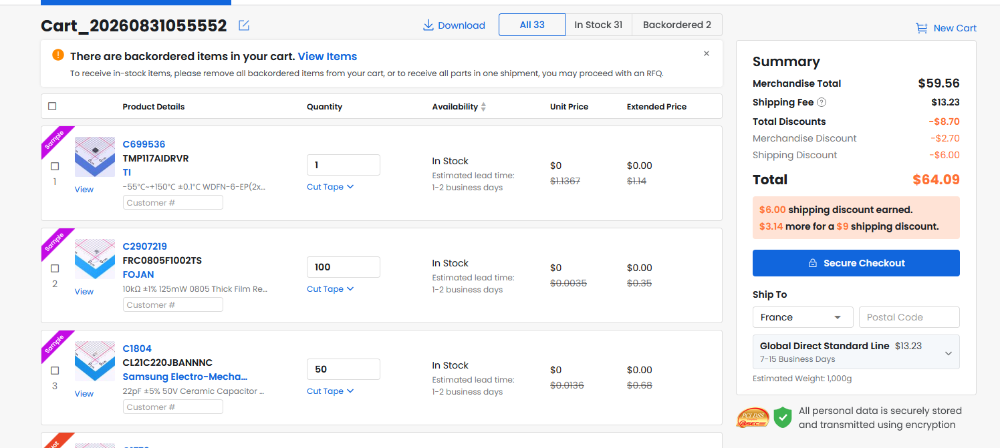

**Total time spent: 3 hours**

# Day 13: Organise workspace & create README.md
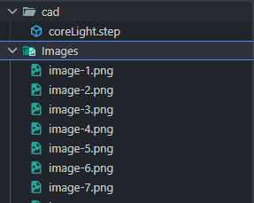

Update image in Images workspace + put cad in /cad folder
I made README: 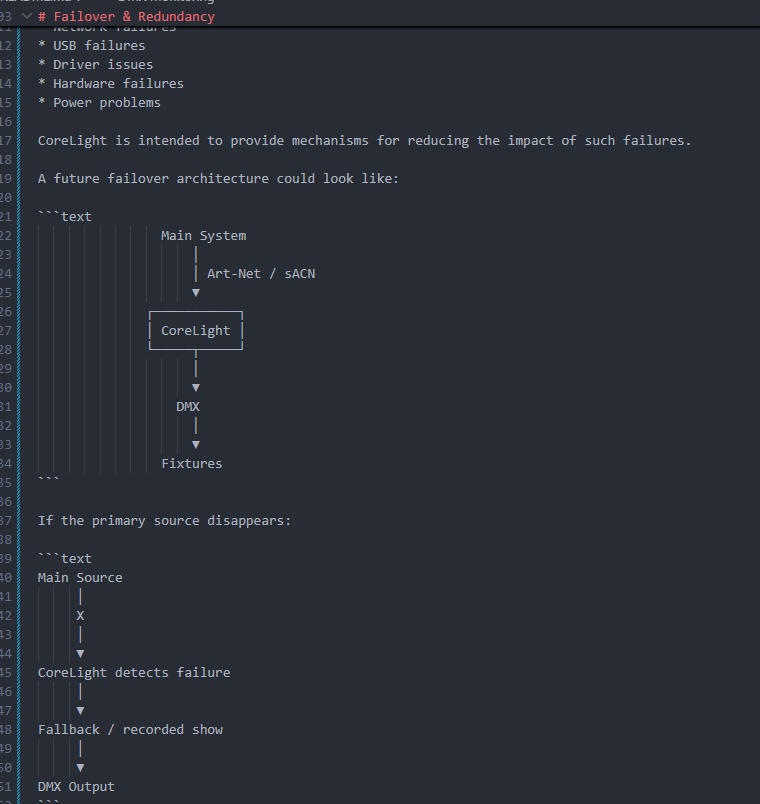

About software part:
Actually I would like flashing QLC+ on this processing unit but after I can flash lot of soft on it

QLCPlus link: https://github.com/mcallegari/qlcplus/

**Total time spent: 0.5 hours**