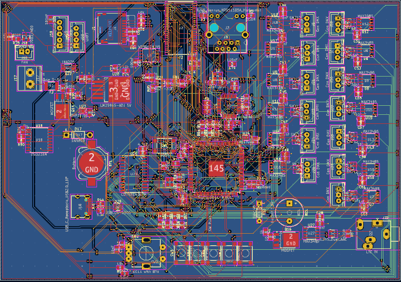

# CoreLight

A DIY high-performance DMX and stage-effect management controller designed around an STM32H743.

CoreLight is a large-scale open-source hardware and software project designed to manage professional-style stage lighting systems, with support for up to **13 DMX universes**, network-based lighting protocols, timecode synchronization, show playback, monitoring and redundancy.

The project is heavily inspired by professional lighting control systems such as the grandMA3 Processing Unit and Replay Unit, while being designed as a DIY, low-cost and reproducible platform.

The goal is not to reproduce a grandMA3 console, but to build a powerful hardware core capable of becoming the foundation of a larger lighting-control ecosystem.

---

# Why am I doing this?

The original idea was to build something resembling a **grandMA3-style lighting control unit**.

I wanted to create a central hardware device capable of handling the real-time communication required by a modern lighting system, while leaving the user interface and higher-level control software open for future development.

The main objectives are:

* Manage up to **13 DMX universes**
* Receive and transmit **Art-Net**
* Support **sACN**
* Synchronize lighting with **LTC/MTC timecode**
* Store and replay lighting shows
* Provide DMX redundancy and failover
* Monitor the DMX network
* Provide RDM capabilities
* Allow external control through OSC
* Provide an internal web interface
* Monitor temperature and power consumption
* Manage internal cooling
* Provide a platform for future lighting-control software

The project is therefore designed around the idea of a **lighting control core**, rather than a traditional lighting console.

---

# Overview

## Features

### Lighting Control

* Up to **13 DMX universes**
* DMX512 output
* Art-Net support
* sACN support
* RDM support
* DMX repeater functionality
* DMX Fusion
* DMX cable monitoring
* Show recording and playback
* Standalone operation
* Failover capabilities

### Synchronization

* LTC timecode input
* Multiple MTC/LTC sources
* Timecode-synchronized show playback
* Event-based triggering

### Network

* Ethernet connection
* Art-Net communication
* sACN communication
* OSC control
* Internal web server

### Hardware Monitoring

* Internal temperature monitoring
* Power monitoring
* Fan control
* Thermal protection
* Status LEDs
* Buzzer alerts

### Storage

* MicroSD storage
* SPI Flash
* External SDRAM
* Show files
* Configuration files
* Logs

### Development & Maintenance

* USB-C
* JST debug/programming connectors
* Firmware update capabilities
* RTC with battery backup

### Mechanical

* Custom PCB
* 4-layer PCB design
* Custom 3D-printed enclosure
* Rack-mountable design
* Active cooling

---

# System Architecture

The overall CoreLight architecture can be represented as:

```text
                         ┌───────────────────────┐
                         │   Lighting Software   │
                         │                       │
                         │ grandMA / QLC+ / etc. │
                         └───────────┬───────────┘
                                     │
                              Art-Net / sACN
                                     │
                                     ▼
                              ┌─────────────┐
                              │  Ethernet   │
                              │    W5500    │
                              └──────┬──────┘
                                     │
                                     ▼
┌──────────────┐              ┌─────────────┐
│ LTC Source   │─────────────►│             │
└──────────────┘              │             │
                              │ STM32H743   │
┌──────────────┐              │             │
│ MTC Source   │─────────────►│    CORE     │
└──────────────┘              │             │
                              │             │
┌──────────────┐              │             │
│ Event Inputs │─────────────►│             │
└──────────────┘              └──────┬──────┘
                                     │
                ┌────────────────────┼────────────────────┐
                │                    │                    │
                ▼                    ▼                    ▼
          ┌───────────┐        ┌───────────┐       ┌───────────┐
          │   DMX 1   │        │   DMX 2   │  ...  │  DMX 13   │
          │  MAX3485  │        │  MAX3485  │       │  MAX3485  │
          └─────┬─────┘        └─────┬─────┘       └─────┬─────┘
                │                    │                    │
                ▼                    ▼                    ▼
             DMX OUT              DMX OUT              DMX OUT


             ┌─────────────────────────────────┐
             │             Storage             │
             │                                 │
             │  SDRAM  │  QSPI Flash │ microSD│
             └─────────────────────────────────┘


             ┌─────────────────────────────────┐
             │          Monitoring             │
             │                                 │
             │ Temperature │ Power │ Fans      │
             └─────────────────────────────────┘
```

The STM32H743 acts as the central real-time processor.

It receives information from the network, timecode interfaces and local inputs, processes the lighting data, and distributes it to the required DMX outputs.

---

# Hardware

The complete Bill of Materials is available in:

[BOM.csv](BOM.csv)

The current prototype uses a combination of high-performance digital hardware, communication interfaces and protection circuitry.

## Main Components

| Component           | Purpose                        |
| ------------------- | ------------------------------ |
| **STM32H743ZIT6**   | Main real-time microcontroller |
| **W5500**           | Ethernet interface             |
| **MAX3485**         | DMX / RS-485 transceivers      |
| **CD74HC4067M**     | Signal routing / multiplexing  |
| **IS42S16400J-7TL** | External SDRAM                 |
| **W25Q128JVSIQ**    | SPI Flash                      |
| **DS3231M+**        | Real-time clock                |
| **INA226AIDGST**    | Power monitoring               |
| **TMP117AIDRVR**    | Temperature monitoring         |
| **SM712**           | DMX transient protection       |
| **USBLC6-2SC6**     | USB ESD protection             |

---

# Processing Core

The main processor is an **STM32H743ZIT6**.

The STM32H7 family was selected because CoreLight needs significantly more processing capability than a simple ESP32-based lighting controller.

The MCU is responsible for:

```text
Network communication
       │
       ├── Art-Net
       ├── sACN
       └── OSC
       
Timecode
       │
       ├── LTC
       └── MTC

DMX Processing
       │
       ├── Universe management
       ├── RDM
       ├── Fusion
       ├── Monitoring
       └── Repeater

Show Control
       │
       ├── Playback
       ├── Events
       ├── Standalone
       └── Failover

System
       │
       ├── Temperature
       ├── Power
       ├── Fans
       └── Logs
```

The processor therefore acts as the central real-time engine of the entire system.

---

# Memory Architecture

CoreLight uses several types of memory because each one serves a different purpose.

## SDRAM

External SDRAM is intended for high-speed temporary data.

It can be used for:

* DMX universe buffers
* Network packet buffers
* Show playback data
* Temporary processing
* Large runtime structures

Conceptually:

```text
                STM32H743
                    │
                    │ FMC
                    ▼
              ┌───────────┐
              │   SDRAM   │
              │           │
              │ Runtime   │
              │ buffers   │
              └───────────┘
```

---

## QSPI Flash

The SPI Flash provides non-volatile storage directly accessible by the MCU.

It can be used for:

* Firmware
* Configuration
* Persistent system data
* Boot resources

The selected device is:

```text
W25Q128JVSIQ
128 Mbit SPI Flash
```

---

## MicroSD

The microSD card is intended for larger user-accessible data.

It can store:

```text
/show
    show1
    show2
    show3

/config
    system configuration

/logs
    system logs

/firmware
    firmware updates
```

This makes the microSD card the main removable storage medium for shows and user data.

---

# DMX System

CoreLight is designed to provide up to **13 DMX output universes**.

Each DMX output uses an RS-485 transceiver.

Conceptually:

```text
                    STM32H743
                        │
              ┌─────────┼─────────┐
              │         │         │
              ▼         ▼         ▼
           DMX 1      DMX 2    ... DMX 13
              │         │         │
           MAX3485   MAX3485   MAX3485
              │         │         │
              ▼         ▼         ▼
           XLR OUT   XLR OUT   XLR OUT
```

Each universe can contain up to:

```text
512 DMX channels
```

Therefore, the complete system can theoretically manage:

```text
13 × 512 = 6656 DMX channels
```

The hardware is consequently designed for considerably larger installations than a single-universe controller.

---

# DMX Physical Layer

DMX512 uses an **RS-485 differential physical layer**.

A standard DMX connection uses:

```text
XLR Pin 1 → Ground / Shield
XLR Pin 2 → Data -
XLR Pin 3 → Data +
```

The DMX data rate is:

```text
250 kbit/s
```

Each DMX output is electrically isolated from the MCU's logic domain through the RS-485 transceiver interface.

Transient protection is provided using **SM712 TVS protection** on the DMX lines.

Conceptually:

```text
STM32
  │
  ▼
MAX3485
  │
  ▼
SM712
  │
  ▼
DMX XLR
```

The protection stage helps protect the electronics against ESD and electrical transients encountered on long stage cables.

---

# Ethernet / Art-Net / sACN

CoreLight includes Ethernet connectivity through a **W5500 Ethernet controller**.

The network interface is intended for lighting protocols such as:

```text
Art-Net
sACN
OSC
```

The architecture is:

```text
Ethernet
    │
    ▼
  W5500
    │
    ▼
STM32H743
    │
    ├── Art-Net
    ├── sACN
    └── OSC
```

Network DMX data can then be mapped to the physical DMX outputs.

For example:

```text
Art-Net Universe 1  → DMX Output 1
Art-Net Universe 2  → DMX Output 2
Art-Net Universe 3  → DMX Output 3
...
Art-Net Universe 13 → DMX Output 13
```

The final software architecture will allow more advanced routing between network universes and physical DMX outputs.

---

# DMX Routing

One of the important software features planned for CoreLight is flexible DMX routing.

Instead of permanently assigning one network universe to one physical port, the system can eventually provide routing such as:

```text
Art-Net Universe 1
        │
        ├──────────────► DMX Output 1
        │
        └──────────────► DMX Output 5


Art-Net Universe 2
        │
        ├──────────────► DMX Output 2
        └──────────────► DMX Output 6
```

This creates a flexible DMX patching system.

---

# RDM

CoreLight is also designed with **RDM (Remote Device Management)** in mind.

RDM extends DMX by allowing bidirectional communication between the controller and compatible lighting fixtures.

Potential functionality includes:

* Fixture discovery
* Device identification
* DMX address configuration
* DMX personality selection
* Manufacturer information
* Device monitoring

This requires the DMX hardware and firmware to support bidirectional RS-485 communication.

---

# LTC Timecode

CoreLight includes a dedicated **LTC input**.

LTC (Linear Timecode) allows lighting events to be synchronized with another show-control system.

A typical setup could be:

```text
Audio / Show Control
        │
        │ LTC
        ▼
   CoreLight
        │
        ▼
Timecode position
        │
        ▼
Lighting events
```

For example:

```text
01:00:00:00
      │
      ▼
Start lighting sequence

01:00:15:00
      │
      ▼
Scene change

01:01:00:00
      │
      ▼
Lighting effect
```

This makes CoreLight suitable for synchronized audio/lighting shows.

---

# Standalone Mode

CoreLight is intended to eventually operate without a permanent connection to a computer.

A show can be stored locally:

```text
Computer
   │
   │ Show upload
   ▼
microSD
   │
   ▼
CoreLight
   │
   ▼
DMX Outputs
```

Once the show has been uploaded, the controller can execute it independently.

This is particularly useful for installations where a dedicated computer is unnecessary.

---

# Show Playback

The system can store lighting shows on the microSD card.

A show may contain:

```text
Scenes
Cues
DMX states
Timing information
Events
Timecode positions
```

During playback, the STM32 reconstructs the required DMX output state.

Conceptually:

```text
             microSD
                │
                ▼
          Show file
                │
                ▼
           STM32H743
                │
        ┌───────┴───────┐
        │               │
     Timing          Events
        │               │
        └───────┬───────┘
                ▼
          DMX Engine
                │
        ┌───────┼────────┐
        ▼       ▼        ▼
      DMX 1   DMX 2    DMX 13
```

---

# Failover & Redundancy

One of the major goals of CoreLight is system redundancy.

A lighting computer can fail because of:

* Software crashes
* Operating system problems
* Network failures
* USB failures
* Driver issues
* Hardware failures
* Power problems

CoreLight is intended to provide mechanisms for reducing the impact of such failures.

A future failover architecture could look like:

```text
                Main System
                    │
                    │ Art-Net / sACN
                    ▼
              ┌───────────┐
              │ CoreLight │
              └─────┬─────┘
                    │
                    ▼
                  DMX
                    │
                    ▼
                Fixtures
```

If the primary source disappears:

```text
Main Source
     │
     X
     │
     ▼
CoreLight detects failure
     │
     ▼
Fallback / recorded show
     │
     ▼
DMX Output
```

The exact failover mechanism is part of the software architecture still under development.

---

# DMX Fusion

Another planned feature is **DMX Fusion**.

The objective is to allow multiple DMX/network sources to contribute to a common output.

For example:

```text
Source A ──────┐
               │
Source B ──────┼──► DMX Fusion ───► DMX Output
               │
Source C ──────┘
```

The software could use different merging strategies depending on the application.

This can be useful for redundancy, distributed control and combining different lighting systems.

---

# DMX Monitoring

CoreLight is also designed to monitor the physical DMX network.

The monitoring system can potentially detect:

* DMX signal presence
* Loss of DMX signal
* Invalid communication
* Output activity
* Communication problems

This can help diagnose problems during a show.

A future monitoring interface could provide information such as:

```text
DMX 01   ONLINE
DMX 02   ONLINE
DMX 03   ONLINE
DMX 04   ERROR
DMX 05   ONLINE
...
DMX 13   ONLINE
```

---

# Thermal Management

Because the system contains a relatively powerful MCU, Ethernet hardware and multiple communication interfaces, thermal management is required.

CoreLight includes:

* Temperature sensors
* Fan output control
* Thermal monitoring
* Buzzer warning
* Status LEDs

The basic control loop is:

```text
Temperature Sensor
        │
        ▼
    STM32H743
        │
        ├──── Temperature normal
        │
        ├──── Fan speed increase
        │
        └──── Thermal warning
                  │
                  ▼
                Buzzer
```

The power and thermal state can also be exposed through the software monitoring system.

---

# Power System

The device is designed around a **24 V DC input**.

The power architecture is approximately:

```text
24V DC INPUT
     │
     ▼
Protection / Fuse
     │
     ▼
Power Regulation
     │
     ├──────────────► 5V
     │
     └──────────────► 3.3V
                           │
                           ├── STM32
                           ├── W5500
                           ├── MAX3485
                           ├── Sensors
                           └── Logic
```

Power consumption can be monitored using the **INA226**.

This allows the firmware to keep track of the electrical state of the system.

---

# Real-Time Clock

CoreLight uses a dedicated **DS3231M+ RTC** with a CR2032 backup battery.

The RTC provides persistent timekeeping even when the main system is powered off.

It can be used for:

* Event timestamps
* Logs
* Scheduled events
* File metadata
* System diagnostics

The architecture is:

```text
CR2032
   │
   ▼
DS3231 RTC
   │
   │ I²C
   ▼
STM32H743
```

The RTC is separate from LTC timecode.

LTC provides **show synchronization**, while the RTC provides **absolute/local system time**.

---

# User Interface

The initial hardware provides a simple local interface consisting of:

* Rotary encoder
* Push buttons
* Status LEDs
* Buzzer

The rotary encoder can be used for menu navigation:

```text
        ┌────────────────────┐
        │     CoreLight      │
        │                    │
        │  > DMX             │
        │    Network         │
        │    Shows           │
        │    Settings        │
        │                    │
        │       ◉            │
        └────────────────────┘
```

A more advanced graphical interface can be developed separately.

---

# Internal Web Server

CoreLight is also intended to expose an internal web interface over Ethernet.

A browser could eventually be used to access:

```text
http://corelight.local
```

The web interface could provide:

* System status
* DMX monitoring
* Network configuration
* Show management
* Logs
* Temperature
* Power monitoring
* Firmware updates
* Configuration

This means the hardware does not necessarily require a dedicated screen for configuration and diagnostics.

---

# PCB Design

The CoreLight PCB is significantly more complex than my previous ESP32-based projects.

The board contains:

```text
STM32H743
External SDRAM
QSPI Flash
Ethernet
13× DMX
LTC
USB-C
MicroSD
RTC
Power regulation
Temperature monitoring
Protection
User interface
```

Because of the high pin count and routing complexity, the PCB was ultimately designed as a **4-layer board**.

The layer structure provides much better routing flexibility and allows dedicated planes for power and ground.

The final PCB contains approximately **192 footprints**.

---

# PCB Development

The PCB was designed using **KiCad**.

The development process involved:

1. Component selection
2. Library installation
3. Schematic creation
4. STM32 pin assignment
5. Footprint assignment
6. Power routing
7. Signal routing
8. STM32 routing
9. 4-layer redesign
10. Design Rule Check / ERC
11. 3D inspection
12. JLCPCB quotation

The STM32 pinout was developed using **STM32CubeMX** before being transferred into the KiCad design.

This was one of the most time-consuming parts of the project.

---

# Mechanical Design

The enclosure is being designed as a custom 3D-printed case.

The objective is to make the device:

* Compact
* Rackable
* Serviceable
* Easy to reproduce
* Easy to modify

The enclosure includes openings for:

```text
DMX outputs
Ethernet
USB-C
LTC
Power
Cooling fan
User interface
```

The current concept is inspired by compact rack-mounted professional lighting hardware.

## Case


Assembly: [text](cad/coreLightAssembly.step)

## CAD Files

CAD files will be available in:


```text
/cad
```

---

# Electronic Design

## Schematic

The complete KiCad schematic is available in:


```text
/scheme
```

The schematic contains the complete system, including:

```text
STM32H743
Ethernet
DMX
Power
Memory
RTC
LTC
USB
MicroSD
Sensors
User interface
```

---

# Bill of Materials

The current component cost estimate is approximately:

```text
Components:    $66.01
PCB:            $36.99
──────────────────────
Total:         ~$103 USD
```

This estimate includes the main electronics and PCB, with the final cost depending on shipping, assembly and future component changes.

The complete BOM is available in:

[BOM.csv](BOM.csv)

---

# Current Project Status

The hardware design has progressed through:

```text
[✓] Project definition
[✓] Architecture research
[✓] Component selection
[✓] STM32 pinout
[✓] KiCad schematic
[✓] ERC validation
[✓] Footprint assignment
[✓] PCB routing
[✓] 4-layer PCB redesign
[✓] PCB 3D model
[✓] JLCPCB cost estimation
[✓] Initial enclosure design
[✓] CAD assembly
[✓] BOM
[ ] PCB manufacturing
[ ] PCB assembly
[ ] Hardware bring-up
[ ] Firmware
[ ] DMX engine
[ ] Art-Net
[ ] sACN
[ ] LTC
[ ] RDM
[ ] Show playback
[ ] Failover
[ ] Web interface
```

The current design should therefore be considered a **hardware prototype / development platform**, rather than a finished professional lighting controller.

---

# Future Development

Several features are planned for future versions:

* Complete 13-universe DMX engine
* Art-Net input/output
* sACN input/output
* RDM
* OSC
* DMX Fusion
* Automatic failover
* DMX signal monitoring
* Show recording
* Show playback
* LTC synchronization
* MTC synchronization
* Standalone playback
* Internal web server
* Firmware update system
* Advanced event engine
* Improved thermal management
* More advanced local UI
* Potential expansion hardware

The long-term objective is to turn CoreLight into the **hardware foundation of a complete open-source lighting control ecosystem**.

---

# Project Journal

The complete development process is documented in:

[JOURNAL.md](JOURNAL.md)

The journal contains the day-by-day development process, including the hardware design, STM32CubeMX configuration, KiCad schematic, PCB routing, CAD design, BOM creation and the problems encountered during development.

This project is being developed progressively, and the journal documents both the successes and the mistakes made along the way.

---

# Inspiration

CoreLight was heavily inspired by professional lighting-control hardware, especially the architecture of systems such as the grandMA3 Processing Unit and Replay Unit.

References:

* [MA Lighting – grandMA3 Processing Unit](https://www.malighting.com/product/grandma3-processing-unit-m-4010510/)
* [MA Lighting – grandMA3 Replay Unit](https://www.malighting.com/product/grandma3-replay-unit-4010507/)

The project is **not affiliated with MA Lighting** and is an independent DIY/open-source project.

---

# License

CoreLight is intended to be an open-source hardware and software project.

The exact hardware, firmware and documentation licenses will be defined as the project progresses.
